# Dark Matter Subhalo Classification


This project is dedicated to the classification of dark matter subhalos using deep learning techniques. We leverage both PyTorch and TensorFlow frameworks to model and predict the classification of dark matter subhalos based on simulated astrophysical data. The project is designed to run efficiently on systems equipped with CUDA-compatible GPUs, offering accelerated computation times for model training and inference.

## Prerequisites

To run this project, you will need:

- A CUDA-compatible GPU (highly recommended for accelerated computation)
- Anaconda or Miniconda installed on your system

## Environment Setup

We use Conda environments to manage dependencies and ensure reproducibility across different setups. Two separate environments are required for this project, one for PyTorch and another for TensorFlow, to prevent dependency conflicts.

### Installing Conda

If you haven't installed Anaconda or Miniconda yet, follow the instructions on the [official Conda website](https://conda.io/projects/conda/en/latest/user-guide/install/index.html) to set it up on your system.

### Creating the Environments

1. **PyTorch Environment**: This environment is optimized for projects using PyTorch. To create it, run the following commands in your terminal:

    ```bash
    conda create --name pytorch_env python=3.8
    conda activate pytorch_env
    conda install pytorch torchvision torchaudio cudatoolkit=11.1 -c pytorch -c nvidia
    pip install -r requirements.txt
    ```

    Replace `cudatoolkit=11.1` with the version that matches your CUDA installation.

2. **TensorFlow Environment**: This environment is set up for TensorFlow projects. Execute the following commands:

    ```bash
    conda create --name tensorflow_env python=3.8
    conda activate tensorflow_env
    pip install tensorflow
    pip install -r requirements.txt
    ```

    Ensure that the TensorFlow version installed is compatible with your CUDA and cuDNN versions.

### Requirements.txt

The `requirements.txt` file should list all the Python libraries that your project depends on. You might need different requirements files for each framework if the dependencies differ significantly. At a minimum, this file should contain:

```bash
numpy
pandas
matplotlib
scikit-learn
```


Add any other libraries your project depends on. If the libraries differ between the PyTorch and TensorFlow environments, consider creating two separate requirements files, e.g., `requirements_pytorch.txt` and `requirements_tensorflow.txt`.


## File Structure

Download data file using this

[Gdown](./path/to/your/notebook.ipynb)

- 📂 Root Directory
  - 📂 00_data
  - 📂 01_EDA
  - 📂 02_Data_Preprocessing
  - 📂 03_Model
  - 📂 04_Data_Models
     

  - 📄 readme.md


# Physics Based Approach


The observable distortions of distant galaxies, known as gravitational lensing, provide an intriguing connection between the types of dark matter and the roles of different galaxies. This phenomenon serves as an illustrative example of how different types of dark matter, despite their elusive nature, can exert gravitational influence and leave noticeable imprints on our observations. Through gravitational lensing, dark matter influences the light path from the source galaxy, causing it to bend around the lensing galaxy. This effect underscores the crucial role of dark matter in determining the large-scale structure of the universe.

</br>
</br>

<div align="center">
  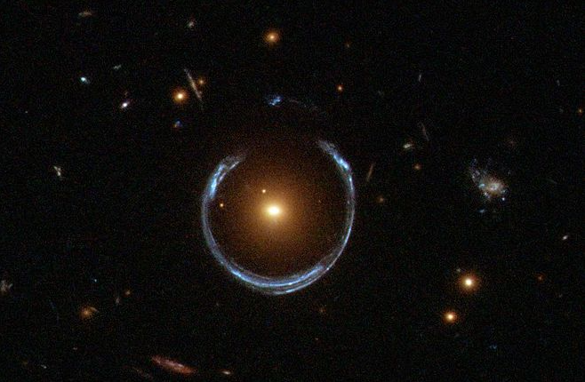
</div>

</br>
</br>

Now, the module performs the following tasks:

* **Reconstructs the source galaxy image**: This task is based on the hypothesis that the gravitational effects of dark matter are negligible in most regions of space, and that the lensing galaxy can be approximated by a Singular Isothermal Sphere.

* **Obtains the approximate parameters of the Sersic Profile of the source galaxy**: Upon reconstructing the source galaxy, an attempt is made to approximate it with a Sersic profile, and the parameters of this distribution are obtained.

* **Gravitational Anomalies Reconstruction**: Using the source galaxy profile and the Sersic approximation, we can derive the profile of gravitational distortions based on the differences in intensity and the estimated Sersic profile.

* **Resize the images**: The module does interpolation to resize the given images to get better resolution.

* **Plotting of Results**: The module itself comes equipped with functions to facilitate the plotting of results.

The equation for gravitational lensing, in its dimensionless form, can be given by the following relation:


The equation for gravitational lensing, in its dimensionless form, can be given by the following relation: &nbsp;&nbsp;&nbsp;&nbsp; $\mathcal{S}(x_s,y_s)$ = $\mathcal{I}(x_i,y_i)$ - $\nabla Ψ(x_iy_i)$


In this equation, $\mathcal{S}(x_s,y_s)$ represents the dimensionless source vector position in the source plane, which corresponds to the position of the source galaxy. On the other hand, $\mathcal{I}(x_i,y_i)$ represents the dimensionless image vector position in the image plane, which corresponds to the image we observe. Finally, $\nabla Ψ(x_i,y_i)$ represents the gradient of the dimensionless gravitational potential produced by the lens, which in our case, includes both the lensing galaxy and the possible dark matter.

</br>
</br>

<div align="center">
  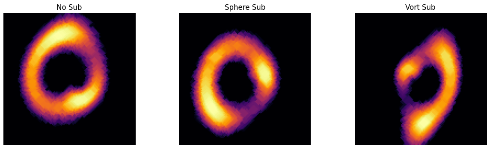
</div>

</br>
</br>


<div align="center">
  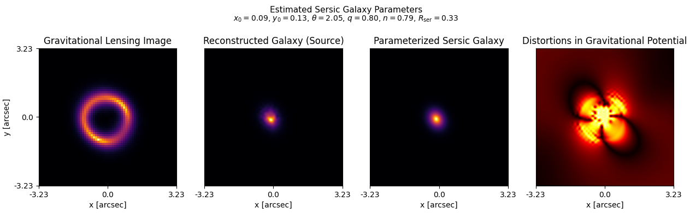
</div>

</br>
</br>

<div align="center">
  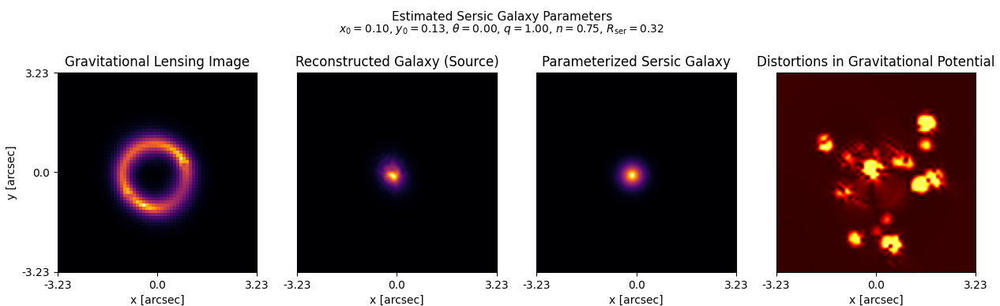
</div>

</br>
</br>

<div align="center">
  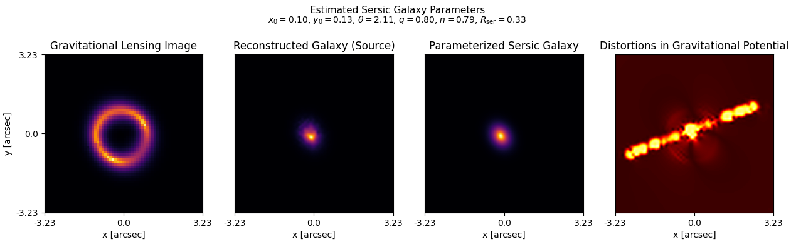
</div>

</br>
</br>


## Limitations

- **SIS Assumption Limitation:** Assuming the lensing galaxy can be modeled as a Singular Isothermal Sphere (SIS) is a significant simplification. Real galaxies often have     complex mass distributions that can deviate substantially from the SIS model. This model ignores contributions from non-lensing mass components, like stars and gas, and does not account for ellipticity or external shearing effects from nearby structures.

- **Neglect of Dark Matter in Certain Regions:** The premise that dark matter has a negligible gravitational effect in most regions might not always hold true, especially in regions with high dark matter density, such as the centers of galaxies or galaxy clusters. These regions can have significant lensing effects that are not captured by the model.

- **Sersic Profile Approximation:** Fitting a Sersic profile to the reconstructed source galaxy image assumes that the galaxy's light distribution follows this specific functional form. However, actual galaxies may have profiles that differ from the Sersic model due to features like bars, spiral arms, or disturbances from interactions.

- **Interpolation Artifacts in Resizing:** Resizing images via interpolation can introduce artifacts, especially when significant upscaling is involved. These artifacts can distort the true signal and potentially introduce biases in the analysis of gravitational anomalies.

- **Limitations in Anomaly Reconstruction:** Deriving the profile of gravitational distortions based on intensity differences and the Sersic profile estimate can be challenging, as it may not account for all sources of noise or intrinsic variations in the source galaxy's brightness profile. It can also be sensitive to the accuracy of the Sersic fit and may not capture all substructures, especially if they are small or have low contrast.


## Research Papers Referred

- [Dark Matter Subhalos, Strong
Lensing and Machine Learning](https://arxiv.org/pdf/2005.05353.pdf)
- [Deep Learning the Morphology of Dark Matter Substructure](https://arxiv.org/abs/1910.00015)
- [Impact of Point Spread Function Higher Moments Error on Weak Gravitational Lensing II: A Comprehensive Study](https://arxiv.org/abs/2205.07892)
- [Mining for Dark Matter Substructure: Inferring subhalo population properties from strong lenses with machine learning
](https://arxiv.org/abs/1909.02005)

## YouTube Videos

- [Subhalo effective density slope measurements from HST strong lensing data with neural likelihood](https://www.youtube.com/watch?v=snNXI-28wJE&t=416s)
- [Probing Dark Matter with Strong Gravitational Lensing](https://www.youtube.com/watch?v=CSomSfYfz_s)
- [CITA 903: Analysis of Strong Gravitational Lensing Data with Machine Learning](https://www.youtube.com/watch?v=FWxs_KWNCR0)
- [S. Birrer | Probing Dark Matter and Dark Energy with Strong Gravitational Lensing](https://www.youtube.com/watch?v=Y8khPqI_foM)
- [Measuring the mass function of dark matter subhalos with ALMA observations of gravitationally lensed](https://www.youtube.com/watch?v=kJXTq4sAOv4)

## Other Resources

- [Notebook 1](./path/to/notebook1.ipynb)
- [Notebook 2](./path/to/notebook2.ipynb)
- [Notebook 3](./path/to/notebook3.ipynb)


<br>
<br>

# Machine Learning Based Approach

This project uses a machine learning based approach to solve the problem. The following models are used in this project:

## Models Used

### Resnet

Resnet, short for Residual Networks, is a classic neural network used as a backbone for many computer vision tasks. This model was introduced in the paper "Deep Residual Learning for Image Recognition".

- **Architecture**: The identity shortcuts in Resnet can be directly used to perform identity mapping, with extra parameters or computation complexity.
- **Performance**: The network is easier to optimize and gains accuracy from considerably increased depth.

### Usage

```python
import tensorflow as tf
from tensorflow.keras import layers, models

# Define the number of classes in your dataset
num_classes = 3  

def build_resnet101V2_model(input_shape=(150, 150, 1), num_classes=num_classes):

    #using imagenet as pretrained weights
    base_model = tf.keras.applications.ResNet101V2(include_top=False,weights='imagenet', input_shape=input_shape)

    # Since we're training from scratch, all layers can be trainable
    base_model.trainable = True

    # Create a new model on top
    inputs = tf.keras.Input(shape=input_shape)

    # Use the generated model
    x = base_model(inputs, training=True)  # Set training=True to ensure BN layers adapt
    
    # Add pooling layer or flatten layer
    x = layers.GlobalAveragePooling2D()(x)

    # Add a dropout layer for some regularization
    x = layers.Dropout(0.2)(x)

    x = layers.Dense(128, activation='relu')(x)

    # Add final dense layer with softmax for classification
    outputs = layers.Dense(num_classes, activation='softmax')(x)

    # Compile the model
    model = models.Model(inputs, outputs)

    model.compile(optimizer='adam',
                  loss='categorical_crossentropy',
                  metrics=['accuracy'])

    return model 

# Build the model
model = build_resnet101V2_model(input_shape=(150, 150, 1), num_classes=num_classes)

# Print the model summary to check the final architecture
model.summary()

```

For more details, please refer to the [Resnet paper](https://arxiv.org/abs/1512.03385).


### DenseNet

DenseNet, short for Densely Connected Convolutional Networks, is a network architecture where each layer is directly connected to every other layer. This was introduced in the paper "Densely Connected Convolutional Networks".

- **Architecture**: DenseNet has a unique architecture where each layer receives input from all preceding layers and passes on its own feature-maps to all subsequent layers. This creates a highly connected network.
- **Performance**: The network has several advantages such as reducing the vanishing-gradient problem, strengthening feature propagation, encouraging feature reuse, and substantially reducing the number of parameters.

For more details, please refer to the [DenseNet paper](https://arxiv.org/abs/1608.06993).

### Usage

```python

import torch.nn as nn
import timm  # Ensure timm is imported for model creation

# Define a DenseNet201 model for image classification
class DenseNet201(nn.Module):
    
    def __init__(self, n_classes):
        super(DenseNet201, self).__init__()
        
        # Load a pre-trained DenseNet201 model from the 'timm' library
        # 'in_chans=1' suggests the model expects grayscale images as input
        self.transfer_learning_model = timm.create_model("densenet201", pretrained=True, in_chans=1)
        
        # Enable training for all parameters in the model
        for param in self.transfer_learning_model.parameters():
            param.requires_grad = True
            
        # Define a classifier to be appended at the end of the DenseNet201
        # The input features dimension (1920*4*4) must match the output features from DenseNet201
        # The classifier ends with 'n_classes' output units for classification
        self.classifier = nn.Sequential(
            nn.Linear(1920 * 4 * 4, 1024),  # First linear layer
            nn.ReLU(),  # Activation function
            nn.BatchNorm1d(1024),  # Batch normalization
            nn.Dropout(p=0.33),  # Dropout to prevent overfitting
            nn.Linear(1024, 64),  # Second linear layer
            nn.ReLU(),  # Activation function
            nn.BatchNorm1d(64),  # Batch normalization
            nn.Dropout(p=0.33),  # Dropout to prevent overfitting
            nn.Linear(64, n_classes)  # Final linear layer for classification
        )
        
    def forward(self, x):
        # Extract features from the input image using DenseNet201
        x = self.transfer_learning_model.forward_features(x)
        # Reshape the output to match the input requirement of the classifier
        x = x.view(-1, 1920 * 4 * 4)
        # Pass the reshaped features through the classifier to get final predictions
        x = self.classifier(x)
        
        return x


```


## LSTM

```python


from tensorflow.keras.models import Sequential
from tensorflow.keras.layers import Dense, LSTM, Conv1D, Dropout, Flatten

# Update parameters based on the revised structure
n_steps = 360  # Sequence length
n_features = 24  # Number of features at each timestep
out_len = 3  # Number of output classes for classification


model = Sequential()

# First Conv1D layer
model.add(Conv1D(filters=50, kernel_size=8, strides=2, activation='relu', input_shape=(n_steps, n_features)))

# Second Conv1D layer
model.add(Conv1D(filters=25, kernel_size=4, strides=2, activation='relu'))

# Dropout for regularization
model.add(Dropout(0.2))

# LSTM layer to process the now flattened sequence
model.add(LSTM(150))

# Additional dropout to prevent overfitting
model.add(Dropout(0.3))

# A Dense layer for feature learning
model.add(Dense(50, activation='relu'))

# Final Dense layer with softmax for classification
model.add(Dense(out_len, activation='softmax'))

# Compile the model
model.compile(loss='categorical_crossentropy', optimizer='adam', metrics=['accuracy'])

# Displaying the model summary
model.summary()


```


## Model Comparsion

| Deep Learning Model                         | Epochs | Batch Size | Learning Rate | Accuracy      | ROC AUC (OvR) | ROC AUC (OvO) |
| :------------------------------------------ | :----- | :--------- | :------------ | :------------ | :------------ | :------------ |
| Resnet101V2                                 | 10     | 64         | 0.0001        | 0.33          | --            | --            |
| Custom LSTM Model                           | 15     | 32         | 0.0001        | 0.33          | --            | --            |
| DenseNet201                                 | 10     | 64         | 0.0001        | 0.97          | 0.99          | 0.99          |


### Results

Results for the Desnet Model is calculated as others where not performing well at the train step


<div style="display: flex; justify-content: space-around;">
  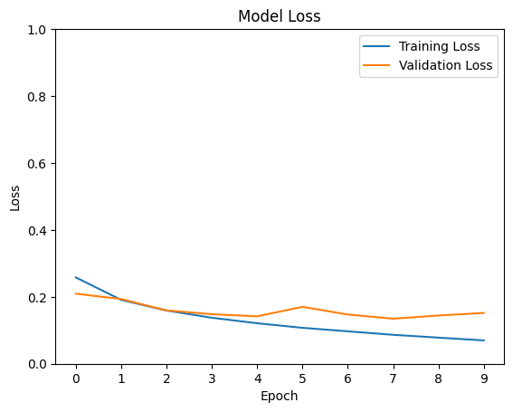
  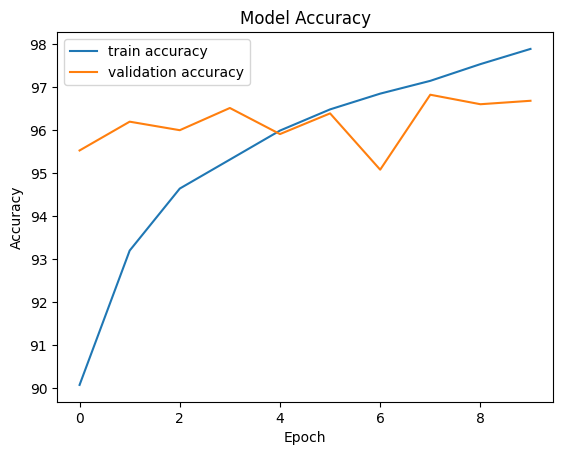
</div>

<br>
<br>
<br>


<div style="display: flex; justify-content: space-around;" >
  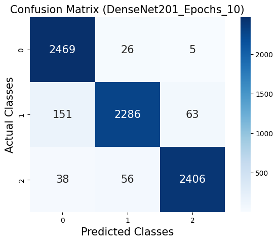
  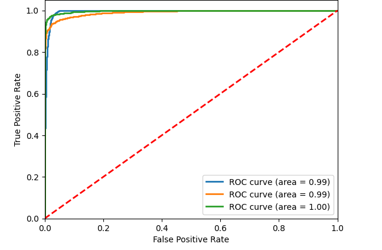
</div>


## Problems Encountered

During the development of this project, I encountered some restrictions with TensorFlow's built-in functions. Due to these limitations, I decided to shift to PyTorch, which provided more flexibility and suited the needs of this project better. Thats why the best model (ie. DenseNet201 is written in Pytorch)

<br>
<br>

## Data Pre-Processing

### Original image for context
<div style="display: flex; gap:30px; align-items: centre;">
    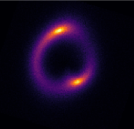
    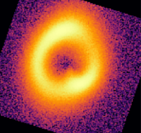
    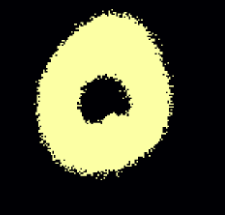
    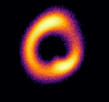
</div>

<br>
<br>

### Thresholding
<br>

```python
def thresholding_image(threshold=0.1):
    
    def inner_thresholding(image):
        # Apply thresholding to create a binary image
        binary_image = (image > threshold).astype(np.float32)

        return image * binary_image
    
    return inner_thresholding

```
<br>
<br>

### Histogram_Normalization
<br>

```python
def histogram_normalization():
    
    def inner_histogram_normalization(image):
        # Equalize the image histogram
        image_norm = exposure.equalize_hist(image)
        return image_norm
    
    return inner_histogram_normalization

```
<br>
<br>

### Erosion_Dilation
<br>

```python
def erosion_dilation(erosion_iter=1, dilation_iter=1, kernel_size=(3,3)):
    
    def inner_erosion_dilation(image):
        # Generate the kernel for morphological operations
        kernel = cv2.getStructuringElement(cv2.MORPH_ELLIPSE, kernel_size)
        # Apply erosion and dilation
        image_eroded = cv2.erode(image, kernel, iterations=erosion_iter)
        image_dilated = cv2.dilate(image_eroded, kernel, iterations=dilation_iter)
        return image_dilated
    
    return inner_erosion_dilation
```
<br>
<br>

